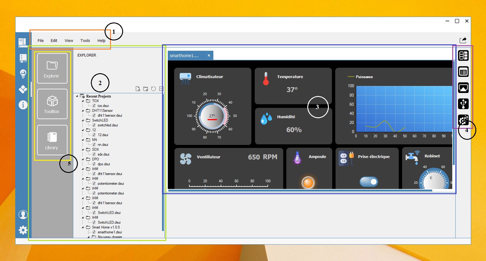

# 🧱 Schrein UI Builder – Version Commuunautaire

**Développé par [Schreiken Technologies SARL](https://schreiken.tech)**

---

## 🎯 Présentation

**Qu’est-ce que Schrein UI Builder ?**

**Schrein UI Builder** est une application conçue pour faciliter la création d'**interfaces graphiques interactives** dédiées au **monitoring et au contrôle de systèmes embarqués et IoT**. Elle permet aux ingénieurs, étudiants et passionnés de concevoir des interfaces **intuitives et modulables** sans nécessiter de compétences avancées en programmation.

**Pourquoi utiliser Schrein UI Builder ?**

Dans un environnement où l’**automatisation, l’IoT et les systèmes embarqués** jouent un rôle clé, la nécessité d’un outil **flexible et performant** pour visualiser et interagir avec les données devient essentielle. **Schrein UI Builde**r répond à ce besoin en offrant une plateforme qui :

- **Ne nécessite aucune programmation (No-Code)**.
- **Simplifie la conception** d’interfaces UI grâce à un système de **glisser-déposer**
- **Permet l'acquisition et le contrôle des données en temps réel** via communication **Série (UART), Bluetooth, WiFi, Ethernet et Cloud**.
- **S’adapte à divers domaines** : automatisation industrielle, mécatronique, agriculture connectée, domotique, etc.
- **Génère des applications autonomes**, prêtes à être utilisées sur le terrain
 
**À qui s’adresse SchreinUI Builder ?**

- **Ingénieurs et techniciens** développant des solutions IoT et embarquées
- **Étudiants et enseignants** en génie électrique, électronique et mécatronique
- **Makers et développeurs** cherchant un outil rapide et efficace pour concevoir des interfaces personnalisées

---
**WorkSpace**

---
## ✨ Fonctionnalités principales

### 🎨 Création d'interfaces
- Glisser-déposer intuitif — *aucune compétence en programmation requise*  
- Bibliothèque de composants riches : **boutons, graphiques, jauges, tableaux**
- Design **responsive** adaptatif pour différents écrans
- Thèmes personnalisables et **branding d'entreprise**

### 🔌 Connectivité avancée
- **TCP/UDP (Client & Serveur)**
- **Ports série (COM)** avec configuration avancée
- **Cloud Schreiken**

### 🚀 Déploiement professionnel
- Génération d’**exécutables autonomes**
- Gestion des **licences intégrée**
- **Mises à jour automatiques**

---

## 📦 Installation

### 🧩 Version Standard
1. Téléchargez l’installateur depuis : [schreiken.tech/download](https://schreiken.tech/download)
2. Exécutez **`SchreinUIBuilder-Setup.exe`**
3. Suivez l’assistant d’installation
4. **Aucune licence d'activation**

---

## 🖥️ Configuration système

| **Composant** | **Minimum** | **Recommandé** |
|----------------|-------------|----------------|
| **OS** | Windows 10 (64-bit) | Windows 11 / Server 2022 |
| **Processeur** | Dual-core 2.0 GHz | Quad-core 3.0 GHz |
| **RAM** | 4 GB | 8 GB+ |
| **Espace disque** | 500 MB | 1 GB+ |
| **Réseau** | Connexion standard | Ethernet industriel |

**Prérequis :** .NET Framework 4.5.0 ou supérieur

---

## 🔧 Démarrage rapide

1. **Créer un nouveau projet** → Choisissez un template  
2. **Glisser-déposer** vos composants d’interface  
3. **Configurer** la connexion à votre périphérique  
4. **Tester** en mode simulation  
5. **Générer** l’exécutable final

---

## 🧰 Exemples d’applications

- Tableaux de bord de **supervision industrielle**  
- Interfaces de **contrôle de machines**  
- Monitoring de **données temps réel**  
- Systèmes de **télémaintenance**

---

## 📊 Protocoles supportés

| **Catégorie** | **Protocoles** |
|----------------|----------------|
| **IoT** | HTTP/HTTPS, WebSockets, SSE |
| **Réseau** | TCP, UDP, WebSocket |
| **Série** | RS-232 |
|**Bluetooth**| Bluetooth Classic|

---

### 📘 Libraries Arduino

- **SchreinSerialParser** : [Communication Série](https://schreiken.tech/schreinserialpaser/)
- **SchreinBluetoothParser** : [Communication Bluetooth](https://schreiken.tech/schreinbluetoothparser/)
- **SchreinWiFiParser** : [Communication WiFi](https://schreiken.tech/schreinwifiparser//)
- **SchreinEthernetParser** : [Communication Ethernet](https://schreiken.tech/schreinethernetparser/)
- **SchreinCloudParser** : [Communication Cloud](https://schreiken.tech/schreincloudparser/)

---

### 🌍 Communauté

- **Tutoriels vidéo** : [Youtube Channel](https://www.youtube.com/@SchreinUIBuilder/)
- **Page Facebook** : [FaceBook Page](https://web.facebook.com/SchreinUIBuilder/)
- **Forum** : [Forum](https://schreiken.tech/forum/))

---

## 📞 Contact

**Support Technique :** support@schreiken.tech  
**WhatsApp :** +237 671 959 237  
**Site officiel :** [https://schreiken.tech](https://schreiken.tech)
  
