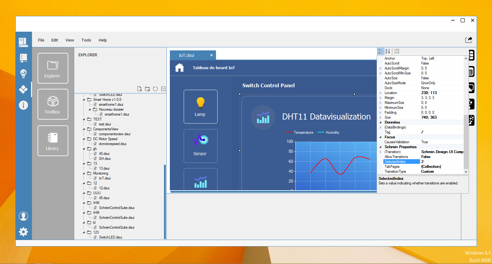
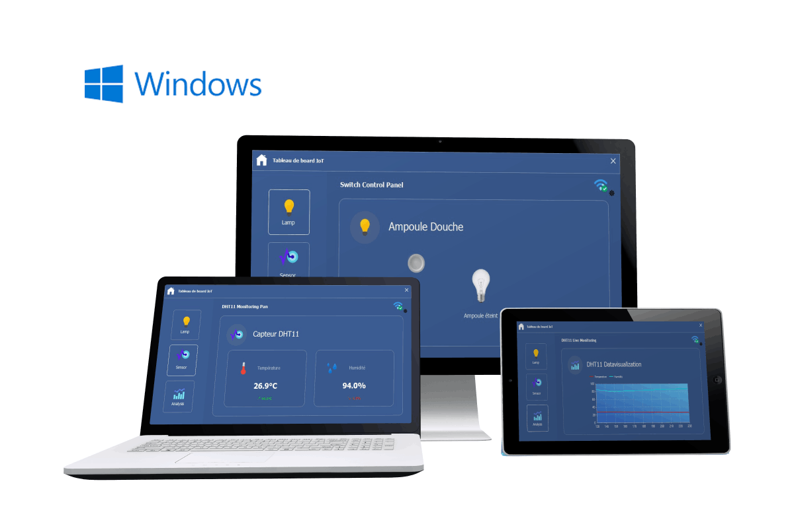
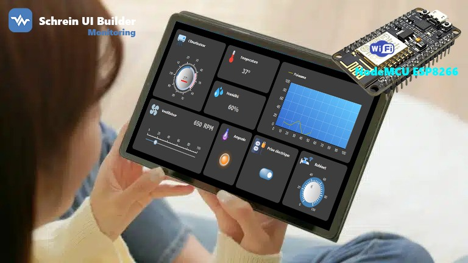
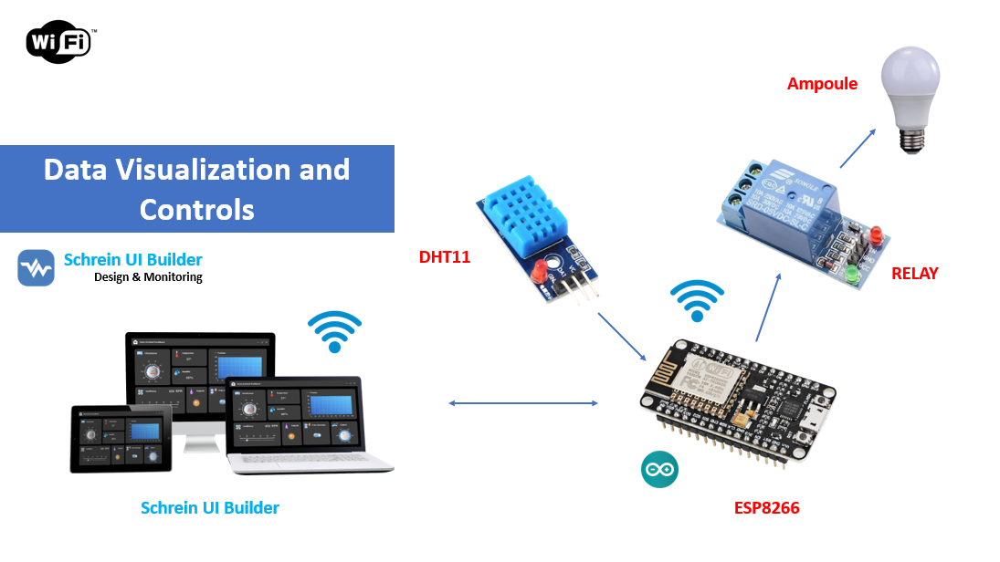
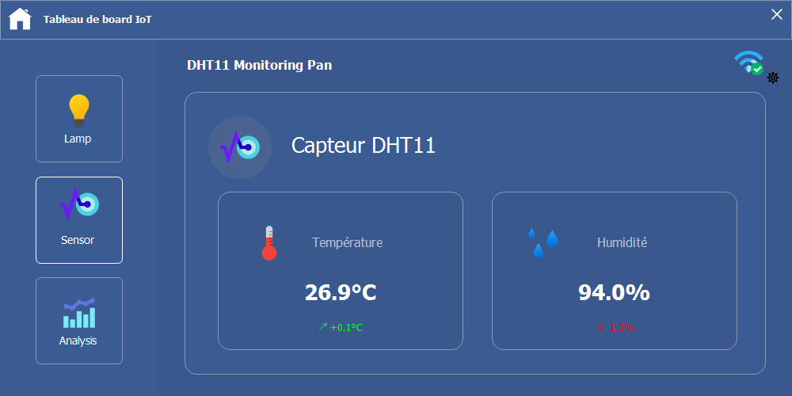

# 🔸 Schrein UI Builder – Version Communautaire

**Développé par [Schreiken Technologies Inc](https://schreiken.tech)**

---

## 🎯 Présentation

**Qu’est-ce que Schrein UI Builder ?**

**Schrein UI Builder** est une application conçue pour faciliter la création d'**interfaces graphiques interactives** dédiées au **monitoring et au contrôle de systèmes embarqués et IoT**. Elle permet aux ingénieurs, étudiants et passionnés de concevoir des interfaces **intuitives et modulables** sans nécessiter de compétences avancées en programmation.

**Pourquoi utiliser Schrein UI Builder ?**

Dans un environnement où l’**automatisation, l’IoT et les systèmes embarqués** jouent un rôle clé, la nécessité d’un outil **flexible et performant** pour visualiser et interagir avec les données devient essentielle. **Schrein UI Builde**r répond à ce besoin en offrant une plateforme qui :

- **Ne nécessite aucune programmation (No-Code)**.
- **Simplifie la conception** d’interfaces UI grâce à un système de **glisser-déposer**
- **Permet l'acquisition et le contrôle des données en temps réel** via communication **Série (COM), Bluetooth, WiFi, Ethernet et Cloud**.
- **S’adapte à divers domaines** : automatisation industrielle, mécatronique, agriculture connectée, domotique, etc.
- **Génère des applications autonomes**, prêtes à être utilisées sur le terrain
 
**À qui s’adresse SchreinUI Builder ?**

- **Ingénieurs et techniciens** développant des solutions IoT et embarquées
- **Étudiants et enseignants** en génie électrique, électronique et mécatronique
- **Makers et développeurs** cherchant un outil rapide et efficace pour concevoir des interfaces personnalisées

---
## 👉 **WorkSpace**

---
## 📦 Installation

### 💡 Version Standard
1. Téléchargez l’installateur
2. Exécutez **`SchreinUIBuilder_Setup_vX.X.X.exe`**
3. Suivez l’assistant d’installation
4. **Aucune licence d'activation**

---

## ⚙️ Configuration système

| **Composant** | **Configuration Minimum** |
|----------------|-------------|
| **OS** | Windows 8.1 (64-bit) |
| **Processeur** | Dual-core 1.2 GHz |
| **RAM** | 4 GB |
| **Espace disque** | 500 MB |
| **Réseau** | Connexion Bluetooth/WiFi |

**Prérequis :** .NET Framework 4.5.0 ou supérieur

---

## 🔧 Démarrage rapide

1. **Créer un nouveau projet** → Choisissez un template  
2. **Glisser-déposer** vos composants d’interface  
3. **Configurer** la connexion à votre périphérique  
4. **Tester** en mode simulation  
5. **Générer** l’exécutable final

  

  

 

---

## 🔹 Exemples d’applications

- Tableaux de bord de **supervision industrielle**  
- Interfaces de **contrôle de machines**  
- Monitoring de **données temps réel**  
- Systèmes de **télémaintenance**

---

## 👉 Monitoring de **données temps réel**

---

## 📘 Libraries Arduino

- **SchreinSerialParser** : [Communication Série (**Multi-plateformes**)](https://schreiken.tech/schreinserialpaser/)
- **SchreinBluetoothParser** : [Communication Bluetooth (**HC-05/HC-06**)](https://schreiken.tech/schreinbluetoothparser/)
- **SchreinWiFiParser** : [Communication WiFi (**ESP8266/ESP32**)](https://schreiken.tech/schreinwifiparser//)
- **SchreinEthernetParser** : [Communication Ethernet (**Ethernet Shield W5100/W5500**)](https://schreiken.tech/schreinethernetparser/)
- **SchreinCloudParser** : [Communication Cloud (**ESP8266/ESP32**)](https://schreiken.tech/schreincloudparser/)

---

## 🚀 Communauté

- **Chaine WhatsApp** : [Schreiken Technologies](https://whatsapp.com/channel/0029Va8bztbAe5Vn9KEuND0O)
- **Groupe FaceBook** : [SchreinUI Community](https://web.facebook.com/groups/598820269809937)
- **Page Facebook** : [Schrein UI Builder](https://web.facebook.com/SchreinUIBuilder/)
- **Groupe WhatsApp** : [Schrein UI Builder](https://chat.whatsapp.com/LqZ1tQbRyYw9QmfWYEZTH7)
  
---

## 🚀 Tutoriels

- **Projets DIY** : [Schrein UI Builder](https://schreiken.tech/category/schreinuibuilder/)
- **Vidéos** : [Schrein UI Builder](https://www.youtube.com/@SchreinUIBuilder/)
- **Forum** : [Forum](https://schreiken.tech/forum/)

---

## 📞 Contact

**Support Technique :** support@schreiken.tech  
**WhatsApp :** +237 671 959 237  
**Site officiel :** [https://schreiken.tech/schreinuibuilder](https://schreiken.tech/schreinuibuilder)
  
